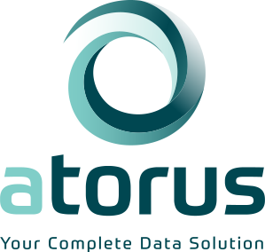
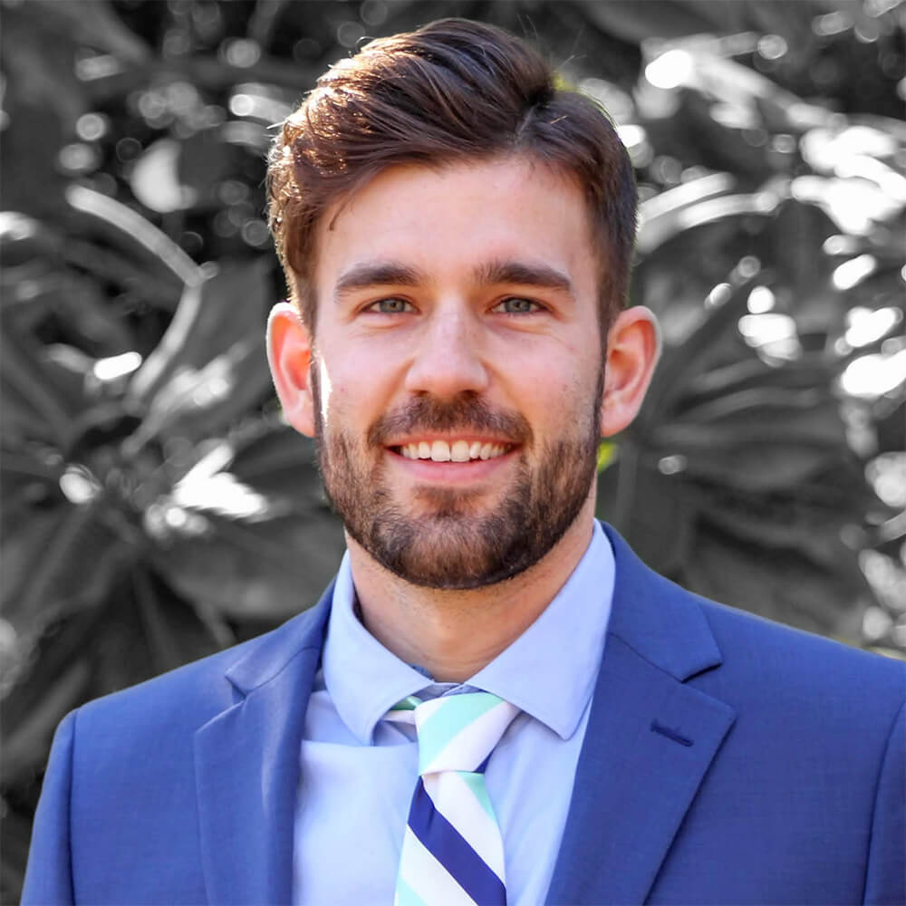

</img></img></img>

 
### What You'll Learn
In this workshop, statistical programmers will be introduced to the R programming language and the tidyverse, using familiar clinical examples. Attendees will leave with a basic understanding of what R is, what the tidyverse is and why it’s important, and what the open-source landscape has to offer us in the world of clinical statistical programming.

Hands-on programming examples will be offered to give attendees some basic knowledge of the tools available in R to support common clinical workflows, such as SDTM, ADaM and clinical TFLs. If you’ve never worked in R before, but want to see how it can be used in your day-to-day tasks, come join us and see what this powerful open-source language has to offer!
  
### Instructors

  </img>
  **Phil Bowsher**  
  Director of Life Sciences & Healthcare at RStudio, Inc

  </img>
  **Mike Stackhouse**  
  Cheif Innovation Officer

  </img>
  **Nathan Kosiba**  
  Software Developer

  </img>
  **Eli Miller**  
  DevOps Engineer

  </img>
  **Maya Gans**  
  Data Visualization Engineer

