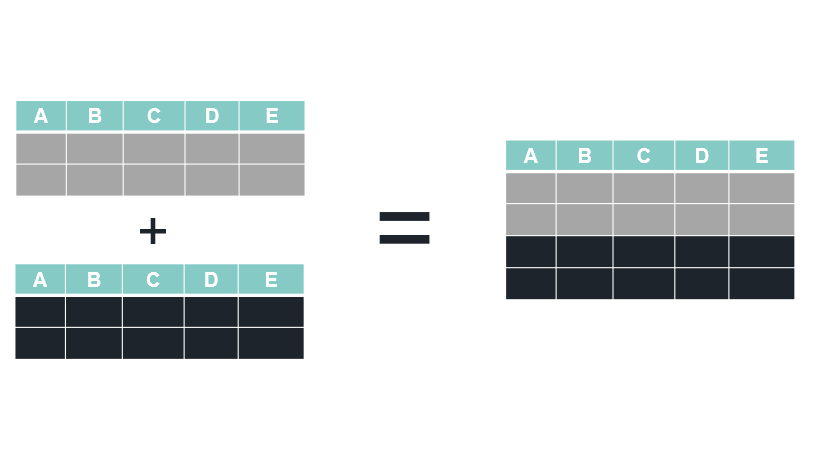
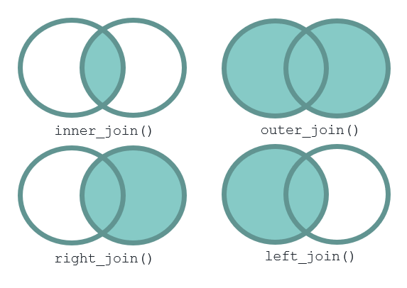
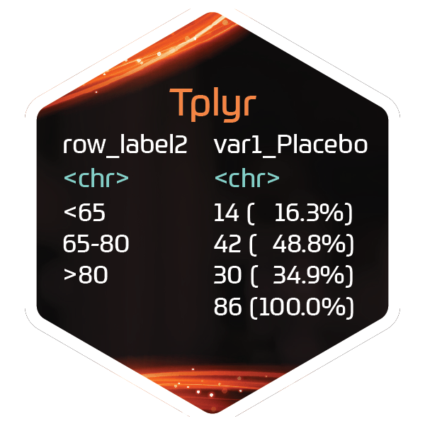

# Introduction

## Workshop Goals

This workshop is not exhaustive but meant to be a first contact with the R programming language. We hope you leave the workshop able to say:

> R isn't scary!

We also hope to show you you can use R to do things with data you're already familiar with, as well as clinical computations.

## Object Types


<span style="background-color:black;color:white;">Data Frames</span>  in R are like Datasets in SAS®. Data frames are made up of columns called `vectors` – treated like Variables in SAS® *More data types exist, but we'll focus on data frames*

<div style="text-align:center;">

<strong>Basic Variable Types</strong>


<span style="color:#1C6972;">Numeric</span>

<span style="color:#FDD26E;">Character</span>

<span style="color:#FF7F41;">Boolean</span>

</div>

```{r, echo=FALSE, warning=FALSE}
library(magrittr)
library(gt)

data.frame(
  a = 1:3,
  b = letters[1:3],
  c = c(TRUE, TRUE, FALSE)
) %>%
  gt() %>%
  tab_options(
    table.background.color = "black",
    table.width = "100%"
  ) %>%
  tab_style(
    style = list(
      cell_fill(color = "#1C6972")),
      locations = cells_body(columns = "a")
  ) %>%
    tab_style(
    style = list(
      cell_fill(color = "#FDD26E")),
      locations = cells_body(columns = "b")
  ) %>%
    tab_style(
    style = list(
      cell_fill(color = "#FF7F41")),
      locations = cells_body(columns = "c")
  )
```


## Assigning Variables


</img>


These two methods yield the **same results**, but the convention is to use `<-`. Learn more [here](https://stat.ethz.ch/R-manual/R-patched/library/base/html/assignOps.html)

## Testing Equality

| Operator | Meaning | Example | 
| --- | --- | --- |
| <- | assign | `x <- y` |
| == | equal to | `x == y` | 
| != | not equal to | `x != y` |
| < | less than | `x < y` | 
| <= | less than or equal to | `x <= y` |
| > | greater than | `x > y` |
| >= | greater than or equal to | `x >= y` |
| `|` | or | `x | y` |

## Arithmetic Operators


| operator | Meaning | Example | Result |
| -------- | ------- | ------- | ------ |
| + | addition | `1 + 1 == 2` | 2 |
| - | subtraction | `1 -1 == 0` | 0 |
| / | division | `6/3 == 2` | 2 |
| * | multiplication | `2 * 3 == 6` | 6 |
| ^ or `**` | exponentiation | `3 ** 2` or `3 ^ 2` | 9 |
| `%%` | modulus | `6%%5` | 1 |
| `%%` | integer division | `7 %% 2` | 3


## A Couple More


| Operator | Meaning | Example | 
| --- | --- | --- |
| & | and | `x & y` |
| ! | not | `!x` | 
| %in% | in | `x %in% y` |


## The Pipe `%>%` Operator

The pipe, `%>%`, is used to create a pipeline of functions and can be read as "and then"

% getting dressed" src="www/pipe.png"></img>

## What are packages?


## What is the tidyverse?

# Working with Data Frames

## Keep/Drop/Rename

## Sub-setting by rows (`where`)

## Sorting

## set AKA bind_rows

</img>

## merge AKA *_join

</img>

## Defining New Variables

## Summarizing Data

# Where to Go From Here:

We mentioned a lot of amazing packages within the R ecosystem that we leverage every day. **click on the package photo for more info and documentation**

<div class="cards">

  <div class="card">
  <a href="https://www.tidyverse.org/">
  </img>
  </a>
  </div>
  
  <div class="card">
  <a href="https://atorus-research.github.io/Tplyr/">
  </img>
  </a>
  </div>
  
  <div class="card">
  <a href="https://ggplot2.tidyverse.org/">
  </img>
  </a>
  </div>
  
  <div class="card">
  <a href="https://atorus-research.github.io/xportr/">
  </img>
  </a>
  </div>
  
  <div class="card">
  <a href="https://stringr.tidyverse.org/">
  
  </img>
  </a>
  </div>
  
  <div class="card">
  <a href="https://lubridate.tidyverse.org/">
  </img>
  </a>
  </div>
  
  <div class="card">
  <a href="https://clock.r-lib.org/">
  </img>
  </a>
  </div>
  

</div>