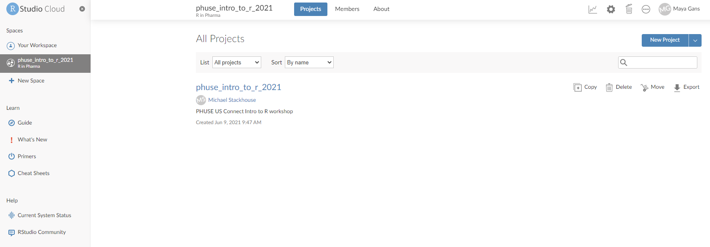
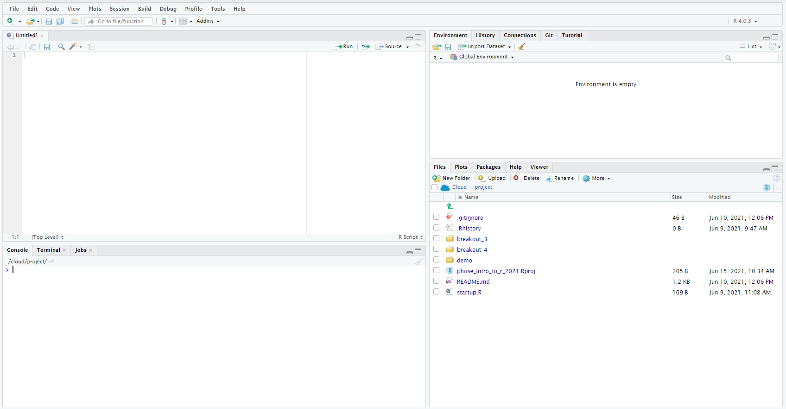

   
## The Cloud

During the workshop we will be using RStudio Cloud. The benefit of this is we can all use R with the same configurations, rather than setting up R on each operating system.

You will receive an email with the link to log in, **and you will need to confirm your email address**. Once logged in, you should see the Phuse_intro_to_R_2021 project:

</img>

Clicking on the project will open an RStudio Session. This is what we will be using to program for the entirety of the course

</img>

