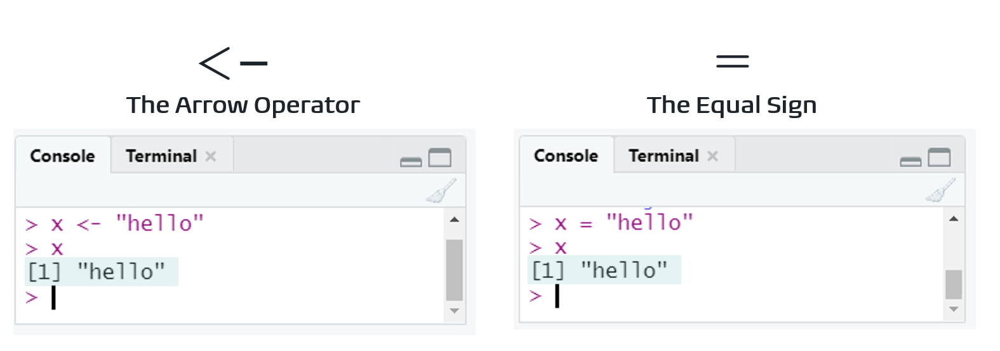

<style>
.row {
  display: flex;
  column-gap: 20px;
}

.col-md-6 {
  width: 45%;
}
</style>


## Workshop Goals

This workshop is not exhaustive but meant to be a first contact with the R programming language. We hope you leave the workshop able to say:

> R isn't scary!

We also hope to show you you can use R to do things with data you're already familiar with, as well as clinical computations.

## Object Types


<span style="background-color:black;color:white;">Data Frames</span>  in R are like Datasets in SAS®. Data frames are made up of columns called `vectors` – treated like Variables in SAS® *More data types exist, but we'll focus on data frames*

<div style="text-align:center;">

<strong>Basic Variable Types</strong>


<span style="color:#1C6972;">Numeric</span>

<span style="color:#FDD26E;">Character</span>

<span style="color:#FF7F41;">Boolean</span>

</div>

```{r, echo=FALSE, warning=FALSE}
library(magrittr)
library(gt)

data.frame(
  a = 1:3,
  b = letters[1:3],
  c = c(TRUE, TRUE, FALSE)
) %>%
  gt() %>%
  tab_options(
    table.background.color = "black",
    table.width = "100%"
  ) %>%
  tab_style(
    style = list(
      cell_text(color = "black"),
      cell_fill(color = "#1C6972")),
      locations = cells_body(columns = "a")
  ) %>%
    tab_style(
    style = list(
      cell_fill(color = "#FDD26E"),
      cell_text(color = "black")),
      locations = cells_body(columns = "b")
  ) %>%
    tab_style(
    style = list(
      cell_fill(color = "#FF7F41"),
      cell_text(color = "black")),
      locations = cells_body(columns = "c")
  )
```


## Assigning Variables


</img>


These two methods yield the **same results**, but the convention is to use `<-`. Learn more [here](https://stat.ethz.ch/R-manual/R-patched/library/base/html/assignOps.html)

## Testing Equality

| Operator | Meaning | Example | 
| --- | --- | --- |
| <- | assign | `x <- y` |
| == | equal to | `x == y` | 
| != | not equal to | `x != y` |
| < | less than | `x < y` | 
| <= | less than or equal to | `x <= y` |
| > | greater than | `x > y` |
| >= | greater than or equal to | `x >= y` |


## Arithmetic Operators


| operator | Meaning | Example | Result |
| -------- | ------- | ------- | ------ |
| + | addition | `1 + 1 == 2` | 2 |
| - | subtraction | `1 -1 == 0` | 0 |
| / | division | `6/3 == 2` | 2 |
| * | multiplication | `2 * 3 == 6` | 6 |
| ^ or `**` | exponentiation | `3 ** 2` or `3 ^ 2` | 9 |
| `%%` | modulus | `6%%5` | 1 |
| `%%` | integer division | `7 %% 2` | 3


## A Couple More


| Operator | Meaning | Example | 
| --- | --- | --- |
| & | and | `x & y` |
| `|` | or | `x | y` |
| ! | not | `!x` | 
| %in% | in | `x %in% y` |


## The Pipe `%>%` Operator

The pipe, `%>%`, is used to create a pipeline of functions and can be read as "and then"

% getting dressed" src="www/pipe.png"></img>

## What are packages?

Packagers are collections of functions and tools to expand the capabilities of R. You can import a package with: `library(package_name)`


## What is the tidyverse?

> The tidyverse is an opinionated collection of R packages designed for data science. All packages share an underlying design philosophy, grammar, and data structures.

> Install the complete tidyverse with:
`install.packages("tidyverse")`

## Keep:

We can keep only the columns <span style="color:#1C6972;">a</span> and <span style="color:#FDD26E;">b</span> from the original `dat`:


```{r, echo=FALSE}
data.frame(
  a = c("X", "X", "Y", "Y"),
  b = c(5,10,2,7),
  c = c(15,20,12,17)
) %>%
  gt() %>%
    tab_options(
    table.width = "100%"
  ) %>%
  tab_style(
    style = list(
      cell_text(color = "black"),
      cell_fill(color = "#1C6972")),
      locations = cells_body(columns = "a")
  ) %>%
    tab_style(
    style = list(
      cell_fill(color = "#FDD26E"),
      cell_text(color = "black")),
      locations = cells_body(columns = "b")
  ) %>%
    tab_style(
    style = list(
      cell_fill(color = "#FF7F41"),
      cell_text(color = "black")),
      locations = cells_body(columns = "c")
  )
```


With the code:

```{r, eval=FALSE}
dat %>%
  select(a,b)
```

```{r, echo=FALSE}
data.frame(
  a = c("X", "X", "Y", "Y"),
  b = c(5,10,2,7)
) %>%
  gt() %>%
  tab_options(
    table.width = "100%"
  ) %>%
  tab_style(
    style = list(
      cell_text(color = "black"),
      cell_fill(color = "#1C6972")),
      locations = cells_body(columns = "a")
  ) %>%
    tab_style(
    style = list(
      cell_fill(color = "#FDD26E"),
      cell_text(color = "black")),
      locations = cells_body(columns = "b")
  )
```


## Drop

We can drop column <span style="color:#FF7F41;">c</span>, choosing everything but column <span style="color:#FF7F41;">c</span>:


```{r, echo=FALSE}
data.frame(
  a = c("X", "X", "Y", "Y"),
  b = c(5,10,2,7),
  c = c(15,20,12,17)
) %>%
  gt() %>%
  tab_options(
    table.width = "100%"
  ) %>%
  tab_style(
    style = list(
      cell_text(color = "black"),
      cell_fill(color = "#1C6972")),
      locations = cells_body(columns = "a")
  ) %>%
    tab_style(
    style = list(
      cell_fill(color = "#FDD26E"),
      cell_text(color = "black")),
      locations = cells_body(columns = "b")
  ) %>%
    tab_style(
    style = list(
      cell_fill(color = "#FF7F41"),
      cell_text(color = "black")),
      locations = cells_body(columns = "c")
  )
```

By using the code:

```{r, eval=FALSE}
dat %>%
  select(-c)
```

```{r, echo=FALSE}
data.frame(
  a = c("X", "X", "Y", "Y"),
  b = c(5,10,2,7)
) %>%
  gt() %>%
  tab_options(
    table.width = "100%"
  ) %>%
  tab_style(
    style = list(
      cell_text(color = "black"),
      cell_fill(color = "#1C6972")),
      locations = cells_body(columns = "a")
  ) %>%
    tab_style(
    style = list(
      cell_fill(color = "#FDD26E"),
      cell_text(color = "black")),
      locations = cells_body(columns = "b")
  )
```


## Sub-setting by rows (`where`)

We can subset `dat` where <span style="color:#1C6972;">f >= 5</span>

```{r, echo=FALSE}
data.frame(
  a = c("X", "X", "Y", "Y"),
  b = c(5,10,2,7),
  c = c(15,20,12,17)
) %>%
  gt() %>%
  tab_options(
    table.width = "100%"
  ) %>%
  tab_options(
    table.width = "100%"
  ) %>%
   tab_style(
    style = cell_fill(color = "#1C6972"),
    locations = cells_body(
      rows = b >= 5)
  )
```

Using the following code:


```{r, eval=FALSE}
dat %>%
  filter(b>=5)
```

```{r, echo=FALSE}
data.frame(
  a = c("X", "X", "Y"),
  b = c(5,10,7)
) %>%
  gt() %>%
  tab_options(
    table.width = "100%"
  ) %>%
  tab_style(
    style = list(
      cell_text(color = "black"),
      cell_fill(color = "#1C6972")),
      locations = cells_body(columns = c("a", "b"))
  ) 
```

## Rename

We can use R's `rename` function to rename columns `a` and `b` to `groups` and `values`. Given this starting data frame:


```{r, echo=FALSE}
data.frame(
  a = c("X", "X", "Y", "Y"),
  b = c(5,10,2,7),
  c = c(15,20,12,17)
) %>%
  gt() %>%
  tab_options(
    table.width = "100%"
  ) %>%
  tab_style(
    style = list(
      cell_text(color = "black"),
      cell_fill(color = "#1C6972")),
      locations = cells_body(columns = "a")
  ) %>%
    tab_style(
    style = list(
      cell_fill(color = "#FDD26E"),
      cell_text(color = "black")),
      locations = cells_body(columns = "b")
  ) %>%
    tab_style(
    style = list(
      cell_fill(color = "#FF7F41"),
      cell_text(color = "black")),
      locations = cells_body(columns = "c")
  )
```

We can use the code:

```{r, eval=FALSE}
dat %>%
  rename(
    groups = a,
    values = b
  )
```


```{r, echo=FALSE}
data.frame(
  groups = c("X", "X", "Y", "Y"),
  values = c(5,10,2,7),
  c = c(15,20,12,17)
) %>%
  gt() %>%
  tab_options(
    table.width = "100%"
  ) %>%
  tab_style(
    style = list(
      cell_text(color = "black"),
      cell_fill(color = "#1C6972")),
      locations = cells_body(columns = "groups")
  ) %>%
    tab_style(
    style = list(
      cell_fill(color = "#FDD26E"),
      cell_text(color = "black")),
      locations = cells_body(columns = "values")
  ) %>%
    tab_style(
    style = list(
      cell_fill(color = "#FF7F41"),
      cell_text(color = "black")),
      locations = cells_body(columns = "c")
  )
```


## Sorting data

Compared to SAS®, you don't have to sort a lot of the time!

When do I sort?
- Presentation
- Order dependent operations (i.e. baseline flag)
- Don't need it for grouping

For instance, if we want to sort our data frame by column b:


```{r, echo=FALSE}
data.frame(
  a = c("X", "X", "Y", "Y"),
  b = c(5,10,2,7),
  c = c(15,20,12,17)
) %>%
  gt() %>%
  tab_options(
    table.width = "100%"
  ) %>%
    tab_style(
    style = list(
      cell_text(color = "black"),
      cell_fill(color = "#FFE5D9")),
      locations = cells_body(columns = "b", rows = b == 2)
  ) %>%
  tab_style(
    style = list(
      cell_text(color = "black"),
      cell_fill(color = "#FFCCB3")),
      locations = cells_body(columns = "b", rows = b == 5)
  ) %>%
    tab_style(
    style = list(
      cell_text(color = "black"),
      cell_fill(color = "#FF7F41")),
      locations = cells_body(columns = "b", rows = b == 7)
  ) %>%
    tab_style(
    style = list(
      cell_text(color = "black"),
      cell_fill(color = "#F04E00")),
      locations = cells_body(columns = "b", rows = b == 10)
  )
```

We can use the `arrange` function on column `b`

```{r, eval=FALSE}
dat %>%
  arrange(b)
```

```{r, echo=FALSE}
data.frame(
  a = c("X", "X", "Y", "Y"),
  b = c(5,10,2,7),
  c = c(15,20,12,17)
) %>%
  dplyr::arrange(b) %>%
  gt() %>%
  tab_options(
    table.width = "100%"
  ) %>%
    tab_style(
    style = list(
      cell_text(color = "black"),
      cell_fill(color = "#FFE5D9")),
      locations = cells_body(rows = b == 2)
  ) %>%
  tab_style(
    style = list(
      cell_text(color = "black"),
      cell_fill(color = "#FFCCB3")),
      locations = cells_body(rows = b == 5)
  ) %>%
    tab_style(
    style = list(
      cell_text(color = "black"),
      cell_fill(color = "#FF7F41")),
      locations = cells_body(rows = b == 7)
  ) %>%
    tab_style(
    style = list(
      cell_text(color = "black"),
      cell_fill(color = "#F04E00")),
      locations = cells_body(rows = b == 10)
  )
```


## set AKA bind_rows

</img>

## merge AKA *_join

</img>


## Adding/editing a variable

We can use the `mutate` function to create new columns using the data from existing columns. For instance we can create a new column `c` by adding 10 to column `b`. We can also use the `mutate` function to or modify existing columns in place. For example, rather than create a new column, we can overwrite column `a` adding `-` before and after each entry. 

#### Original Data 

```{r, echo=FALSE}
data.frame(
  a = c("X", "X", "Y", "Y"),
  b = c(5,10,2,7)
) %>%
  gt() %>%
  tab_options(
    table.width = "100%"
  ) %>%
  tab_style(
    style = list(
      cell_text(color = "black"),
      cell_fill(color = "#1C6972")),
      locations = cells_body(columns = "a")
  ) %>%
    tab_style(
    style = list(
      cell_fill(color = "#FDD26E"),
      cell_text(color = "black")),
      locations = cells_body(columns = "b")
  ) 
```

Using the following code:

```{r, eval=FALSE}
dat %>%
  mutate(
    c = b + 10,
    a = paste0("-", a, "-")
)
```

```{r, echo=FALSE}
data.frame(
  a = c("-X-", "-X-", "-Y-", "-Y-"),
  b = c(5,10,2,7),
  c = c(15,20,12,17)
) %>%
  gt() %>%
  tab_options(
    table.width = "100%"
  ) %>%
  tab_style(
    style = list(
      cell_text(color = "black"),
      cell_fill(color = "#1C6972")),
      locations = cells_body(columns = "a")
  ) %>%
    tab_style(
    style = list(
      cell_fill(color = "#FDD26E"),
      cell_text(color = "black")),
      locations = cells_body(columns = "b")
  ) %>%
    tab_style(
    style = list(
      cell_fill(color = "#FF7F41"),
      cell_text(color = "black")),
      locations = cells_body(columns = "c")
  )
```

## `if_else` logic

We can use `if_else` within a mutate to create new columns based on another column. For instance, we can create a categorical column of `High` and `Low` values based on column `b`:

```{r, echo=FALSE}
data.frame(
  a = c("X", "X", "Y", "Y"),
  b = c(5,10,2,7)
) %>%
  gt() %>%
  tab_options(
    table.width = "100%"
  ) %>%
  tab_style(
    style = list(
      cell_text(color = "black"),
      cell_fill(color = "#1C6972")),
      locations = cells_body(rows = b <= 5, columns = "b")
  ) %>%
    tab_style(
    style = list(
      cell_fill(color = "#FDD26E"),
      cell_text(color = "black")),
      locations = cells_body(rows = b > 5, columns = "b")
  ) 
```

We can use this code: 

```{r, eval=FALSE}
dat %>%
  mutate(
    level = if_else(b > 5,
                    "High",
                    "Low")
    )
```

```{r, echo=FALSE}
data.frame(
  a = c("X", "X", "Y", "Y"),
  b = c(5,10,2,7),
  level = c("Low", "High", "Low", "High")
) %>%
  gt() %>%
  tab_options(
    table.width = "100%"
  ) %>%
  tab_style(
    style = list(
      cell_text(color = "black"),
      cell_fill(color = "#1C6972")),
      locations = cells_body(rows = b <= 5, 
                             columns = c("b", "level")
                             )
  ) %>%
    tab_style(
    style = list(
      cell_fill(color = "#FDD26E"),
      cell_text(color = "black")),
      locations = cells_body(rows = b > 5, 
                             columns = c("b", "level")
      )
  ) 
```

But what if we want another, `Medium` category for values greater than `3` but less than `7`?

```{r, echo=FALSE}
data.frame(
  a = c("X", "X", "Y", "Y"),
  b = c(5,10,2,7)
) %>%
  gt() %>%
  tab_options(
    table.width = "100%"
  ) %>%
  tab_style(
    style = list(
      cell_text(color = "black"),
      cell_fill(color = "#1C6972")),
      locations = cells_body(rows = b == 2, columns = "b")
  ) %>%
    tab_style(
    style = list(
      cell_fill(color = "#FDD26E"),
      cell_text(color = "black")),
      locations = cells_body(rows = b == 10 , columns = "b")
  ) %>%
    tab_style(
    style = list(
      cell_fill(color = "#FF7F41"),
      cell_text(color = "black")),
      locations = cells_body(rows = b == 5, columns = "b")
  ) %>%
    tab_style(
    style = list(
      cell_fill(color = "#FF7F41"),
      cell_text(color = "black")),
      locations = cells_body(rows = b == 7, columns = "b")
  ) 
```

If we were to use an `if_else` statement that would require nesting

```{r, eval=FALSE}
dat %>%
  mutate(
    level = if_else(b < 3, "Low",
                    if_else(b < 8, "Mid",	"High"))
    )
```

But this is really hard to read! Lucky for us we can use the `case_when` function.

The structure of `case_when` can be read as: 

- Left side of `~` True/False or something that evaluates to True/False

- Right side of `~` Value to return


```{r, eval=FALSE}
dat %>%
  mutate(
    level = case_when(
      b < 3 ~ "Low",
      b < 8 ~ "Mid",
      TRUE ~ "High"
    )
  )
```


```{r, echo=FALSE}
data.frame(
  a = c("X", "X", "Y", "Y"),
  b = c(5,10,2,7),
  level = c("Medium", "High", "Low", "Medium")
) %>%
  gt() %>%
  tab_options(
    table.width = "100%"
  ) %>%
  tab_style(
    style = list(
      cell_text(color = "black"),
      cell_fill(color = "#1C6972")),
      locations = cells_body(rows = b == 2)
  ) %>%
    tab_style(
    style = list(
      cell_fill(color = "#FDD26E"),
      cell_text(color = "black")),
      locations = cells_body(rows = b == 10)
  ) %>%
    tab_style(
    style = list(
      cell_fill(color = "#FF7F41"),
      cell_text(color = "black")),
      locations = cells_body(rows = b == 5)
  ) %>%
    tab_style(
    style = list(
      cell_fill(color = "#FF7F41"),
      cell_text(color = "black")),
      locations = cells_body(rows = b == 7)
  ) 
```


## rowwise vs column operators 


<div class="row">
<div class="col-md-6">
```{r, eval=FALSE}
dat %>%
  mutate(
    c = mean(c(a,b))
  )
#
```


```{r, echo=FALSE}
data.frame(
  a = c(5,16,3,3),
  b = c(5,10,2,7),
  c = 6.375
) %>%
  gt() %>%
    tab_options(
    table.width = "100%"
  ) %>%
  tab_style(
    style = list(
      cell_text(color = "black"),
      cell_fill(color = "#1C6972")),
      locations = cells_body(columns = "a")
  ) %>%
    tab_style(
    style = list(
      cell_fill(color = "#FDD26E"),
      cell_text(color = "black")),
      locations = cells_body(columns = "c")
  ) %>%
    tab_style(
    style = list(
      cell_fill(color = "#FF7F41"),
      cell_text(color = "black")),
      locations = cells_body(columns = "b")
  )
```

</div>

<div class="col-md-6">
```{r, eval=FALSE}
dat %>%
  rowwise() %>%
  mutate(
    c = mean(c(a,b))
  )
```

```{r, echo=FALSE}
data.frame(
  a = c(5,16,3,3),
  b = c(5,10,2,7),
  c = c(5,13,2.5,5)
) %>%
  gt() %>%
    tab_options(
    table.width = "100%"
  ) %>%
      tab_style(
    style = list(
      cell_text(color = "black"),
      cell_fill(color = "#FFE5D9")),
      locations = cells_body(rows = b == 5)
  ) %>%
  tab_style(
    style = list(
      cell_text(color = "black"),
      cell_fill(color = "#FFCCB3")),
      locations = cells_body(rows = b == 10 )
  ) %>%
    tab_style(
    style = list(
      cell_text(color = "black"),
      cell_fill(color = "#FF7F41")),
      locations = cells_body(rows = b == 2)
  ) %>%
    tab_style(
    style = list(
      cell_text(color = "black"),
      cell_fill(color = "#F04E00")),
      locations = cells_body(rows = b == 7)
  ) %>%
    tab_style(
    style = list(
      cell_fill(color = "#FDD26E"),
      cell_text(color = "black")),
      locations = cells_body(columns = "c")
  )

```

</div>
</div>

## Descriptive Statistics

```{r, echo=FALSE}
data.frame(
  a = c("X", "X", "Y", "Y"),
  b = c(5,10,2,7)
) %>%
  gt() %>%
    tab_options(
    table.width = "100%"
  )
```

```{r, eval=FALSE}
dat %>%
  summarize(
    mean = mean(b),
    sd = sd(b),
    min = min(b),
    max = max(b)
  )
```

```{r, echo=FALSE}
data.frame(
  mean = 6,
  sd = 3.36,
  min = 2,
  max = 10
) %>%
  gt() %>%
    tab_options(
    table.width = "100%"
  )
```

## Grouped Descriptive Statistics

```{r, echo=FALSE}
data.frame(
  a = c("X", "X", "Y", "Y"),
  b = c(5,10,2,7)
) %>%
  gt() %>%
    tab_options(
    table.width = "100%"
  ) %>%
    tab_style(
    style = list(
      cell_text(color = "black"),
      cell_fill(color = "#F04E00")),
      locations = cells_body(rows = a == "X")
  ) %>%
    tab_style(
    style = list(
      cell_fill(color = "#FDD26E"),
      cell_text(color = "black")),
      locations = cells_body(rows = a == "Y")
  )
  
```

```{r, eval=FALSE}
dat %>%
  group_by(a) %>%
  summarize(
    mean = mean(b),
    sd = sd(b),
    min = min(b),
    max = max(b)
  )
```

```{r, echo=FALSE}
data.frame(
  a = c("X", "Y"),
  mean = c(7.5, 4.5),
  sd = 3.53,
  min = c(5,2),
  max = c(10,7)
) %>%
  gt() %>%
    tab_options(
    table.width = "100%"
  ) %>%
    tab_style(
    style = list(
      cell_text(color = "black"),
      cell_fill(color = "#F04E00")),
      locations = cells_body(rows = a == "X")
  ) %>%
    tab_style(
    style = list(
      cell_fill(color = "#FDD26E"),
      cell_text(color = "black")),
      locations = cells_body(rows = a == "Y")
  )
```

## Counting

### Option 1

```{r, echo=FALSE}
data.frame(
  a = c("X", "X", "X", "Y", "Y"),
  b = c("dog", "cat", rep("rabbit", 3))
) %>%
  gt() %>%
    tab_options(
    table.width = "100%"
  ) %>%
    tab_style(
    style = list(
      cell_text(color = "black"),
      cell_fill(color = "#F04E00")),
      locations = cells_body(rows = b == "dog")
  ) %>%
    tab_style(
    style = list(
      cell_fill(color = "#FDD26E"),
      cell_text(color = "black")),
      locations = cells_body(rows = b == "cat")
  ) %>%
  tab_style(
    style = list(
      cell_fill(color = "#1C6972"),
      cell_text(color = "black")),
      locations = cells_body(rows = b == "rabbit")
  )
```

```{r, eval=FALSE}
dat %>% 
  group_by(b) %>% 
  summarize( 
    n = n() 
  )
```

```{r, echo=FALSE}
data.frame(
  a = c(1,1,3),
  b = c("dog", "cat", "rabbit")
) %>%
  gt() %>%
    tab_options(
    table.width = "100%"
  ) %>%
    tab_style(
    style = list(
      cell_text(color = "black"),
      cell_fill(color = "#F04E00")),
      locations = cells_body(rows = b == "dog")
  ) %>%
    tab_style(
    style = list(
      cell_fill(color = "#FDD26E"),
      cell_text(color = "black")),
      locations = cells_body(rows = b == "cat")
  ) %>%
  tab_style(
    style = list(
      cell_fill(color = "#1C6972"),
      cell_text(color = "black")),
      locations = cells_body(rows = b == "rabbit")
  )
```

### Option 2

```{r, echo=FALSE}
data.frame(
  a = c("X", "X", "X", "Y", "Y"),
  b = c("dog", "cat", rep("rabbit", 3))
) %>%
  gt() %>%
    tab_options(
    table.width = "100%"
  ) %>%
    tab_style(
    style = list(
      cell_text(color = "black"),
      cell_fill(color = "#F04E00")),
      locations = cells_body(rows = b == "dog")
  ) %>%
    tab_style(
    style = list(
      cell_fill(color = "#FDD26E"),
      cell_text(color = "black")),
      locations = cells_body(rows = b == "cat")
  ) %>%
  tab_style(
    style = list(
      cell_fill(color = "#1C6972"),
      cell_text(color = "black")),
      locations = cells_body(rows = b == "rabbit")
  )
```

```{r, eval=FALSE}
dat %>% 
  count(b)
```

```{r, echo=FALSE}
data.frame(
  a = c(1,1,3),
  b = c("dog", "cat", "rabbit")
) %>%
  gt() %>%
    tab_options(
    table.width = "100%"
  ) %>%
    tab_style(
    style = list(
      cell_text(color = "black"),
      cell_fill(color = "#F04E00")),
      locations = cells_body(rows = b == "dog")
  ) %>%
    tab_style(
    style = list(
      cell_fill(color = "#FDD26E"),
      cell_text(color = "black")),
      locations = cells_body(rows = b == "cat")
  ) %>%
  tab_style(
    style = list(
      cell_fill(color = "#1C6972"),
      cell_text(color = "black")),
      locations = cells_body(rows = b == "rabbit")
  )
```

### Grouped Option 1

```{r, echo=FALSE}
data.frame(
  a = c("X", "X", "X", "Y", "Y"),
  b = c("dog", "cat", rep("rabbit", 3))
) %>%
  gt() %>%
    tab_options(
    table.width = "100%"
  ) %>%
    tab_style(
    style = list(
      cell_text(color = "black"),
      cell_fill(color = "#F04E00")),
      locations = cells_body(rows = b == "dog")
  ) %>%
    tab_style(
    style = list(
      cell_fill(color = "#FDD26E"),
      cell_text(color = "black")),
      locations = cells_body(rows = b == "cat")
  ) %>%
  tab_style(
    style = list(
      cell_fill(color = "#1C6972"),
      cell_text(color = "black")),
      locations = cells_body(rows = b == "rabbit")
  )
```

```{r, eval=FALSE}
dat %>% 
  group_by(a, b) %>% 
  summarize( 
    n = n() 
  )
```

```{r, echo=FALSE}
data.frame(
  a = c(1,1,3),
  b = c("dog", "cat", "rabbit")
) %>%
  gt() %>%
    tab_options(
    table.width = "100%"
  ) %>%
    tab_style(
    style = list(
      cell_text(color = "black"),
      cell_fill(color = "#F04E00")),
      locations = cells_body(rows = b == "dog")
  ) %>%
    tab_style(
    style = list(
      cell_fill(color = "#FDD26E"),
      cell_text(color = "black")),
      locations = cells_body(rows = b == "cat")
  ) %>%
  tab_style(
    style = list(
      cell_fill(color = "#1C6972"),
      cell_text(color = "black")),
      locations = cells_body(rows = b == "rabbit")
  )
```

### Other Options

In the course we also showcase 2 other ways to achieve the same goal. The first is using `group_by` and `count`

```{r, eval=FALSE}
dat %>%
  group_by(a) %>% 
  count(b)
```

or with even shorter code, calling `count` on both columns we'd like to group by:

```{r, eval=FALSE}
dat %>%
  count(a, b)
```

